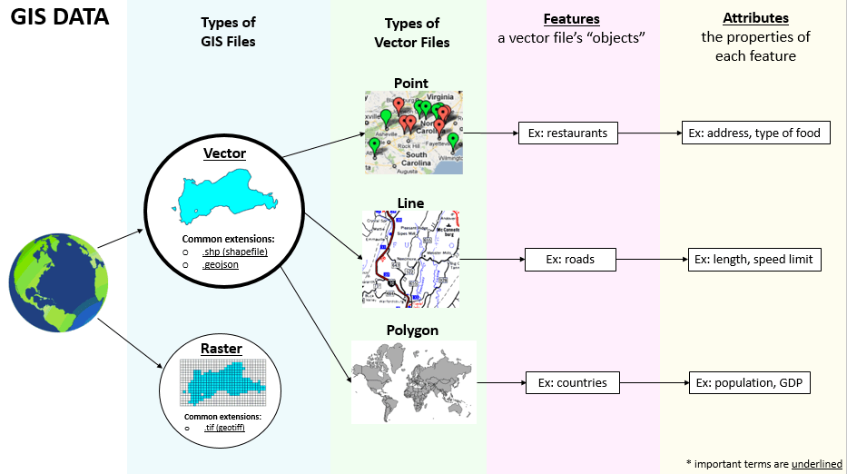

# Week 3

## Agenda
0. [Announcements](#announcements)
1. [Talking about homework/readings](#readings)
2. [Projections](#projections)
3. [GIS basics](#gis)
4. [Homework](#homework)

## 0. Announcements

I like to give students a chance to give me anonymous feedback during the semester, so I can  make improvements as we go. Now that we're ~20% of the way through the semester (congrats, everyone!), you might find that you have things to say. [This form is for you, optionally and anonymously, to fill out](https://forms.gle/8byp3BTu2ex127Xk8). I'll leave it up all semester, and it's also linked under the [files](../files) subfolder. 

I signed up for [this cool mapping metadata event we talked about last week](https://pitt.libcal.com/calendar/today/pghhistories), so if you're free then and the sort of person who will only go if you know somebody there (no judgment from me on that!), I'll be there. I did put a note in my registration letting them know I was going to ask them about coming in to work with us on a Monday night... we'll see how it goes. 

DAT-202 is going to [this event](https://www.meetup.com/PGH-Data-Science/events/267877749/), and you're invited to join us! (It's a Tuesday night, in Oakland.)

The DAT, MMC, and CIT faculty put in our schedule request for fall. On the DAT side, we're looking at running 102, 119, 129, 201, 202 (DA 2), and 203 (Data Viz). We don't have professors assigned to classes, yet, but most likely Professor Darsow will have 203 on Thursday nights, and I'll have 202 on Tuesday nights. 

## 1. Talking about homework &amp; readings

Write up an index card (I'll hand some out) with the following:
* Your name
* A command line interface (CLI) or Linux trick I might not know. (I'm going to share tips with the class, but I'll keep it anonymous unless you say on the card that you want credit. :))
* Any lingering questions you have about Linux, the CLI, anything else DAT-related.

### Bad maps

Let's talk about the lies maps tell us. What surprised you, in the readings? Do you have any examples of misleading maps you want to show off? 

### Good maps

* The classic example: [John Snow](https://en.wikipedia.org/wiki/John_Snow#Cholera)
* Not a map, per se, but certainly an excellent use of GIS: [Using GIS to Develop a Priority Work Area in Western North Carolina](http://www.conservationgis.org/scgis/2011Contest/INH%20Mark%20Endries%20PriorityWorkAreas.pdf)
* So many [@amazingmap on Twitter](https://twitter.com/amazingmap)

## 2. Projections

We live on a planet that is roughly spherical. Paper and computer screens are generally flat. This presents some problems.

 
*image &amp; alt text courtesy of [XKCD](https://xkcd.com/977/)*

### Some tools to help us understand ~~the comic above~~ projections
* [First, a short video](https://www.youtube.com/watch?v=vVX-PrBRtTY)
* [A tool showing map projection distortions](http://bl.ocks.org/syntagmatic/raw/ba569633d51ebec6ec6e/)
    * Acc. 40° 150% – The Acceptance index is a numerical measure that summarizes overall projection distortion, in this case with a maximum angular distortion of 40° and areal distortion of up to 150%.
    * Scale – The weighted mean error for overall scale distortion.
    * Areal – The weighted mean error for areal distortion.
    * Angular – The mean angular deformation index.
* [Comparing true sizes of various geographical and political boundaries](https://thetruesize.com/)
* [An image showing the distortions from various flat plotting methods](https://geoawesomeness.com/amazing-image-1921-will-explain-essence-map-projections/)
* [A map projection/distortion visualization](https://ncxiao.github.io/map-projections/index.html) - uses both [Tissot's indicatrix](https://www.esri.com/arcgis-blog/products/product/mapping/tissots-indicatrix-helps-illustrate-map-projection-distortion/) and the Gedymin faces (from the link above)
* Bonus, if you're interested: [a 2001 article comparing tools for understanding map projections](https://link.gale.com/apps/doc/A78393275/AONE?u=pitt92539&sid=AONE&xid=58f394ec)

### Some questions I want us to answer:

1. What kinds of projections allow us to maintain greater angular fidelity (as compared to the spherical globe)? What kinds maintain greater distance fidelity? 
2. Describe the ideal use cases for several types of projection system given the range of possible uses of a map. (Consider navigation, surveying, representations at various scales, etc.)

##  3. GIS

"GIS" stands for "Geographic Information System." Wikipedia's definition is fine: "a system designed to capture, store, manipulate, analyze, manage, and present spatial or geographic data." This encompasses the hardware, software, data, and people involved in a geospatial analysis. 
But "GIS" sometimes means "Geographic Information Systems," the field. 

Concepts:
* Geographical vs. political boundaries
* Vector vs. raster file types
* Points, lines, polygons
* Layers

*image [credit](http://metrocosm.com/qgis/)*

Let's talk about the kinds of problems that can be solved with GIS. 

##  4. Homework

You actually need to have QGIS up and running next week. For real. If you got it working in your virtual machine, great! If you want to run it on your own machine, in your favorite operating system, that's also great! It'll be helpful to you later in the semester if you have QGIS and PostgreSQL on the same system, and that system really shouldn't be Windows, but if you want to make "get QGIS running on Linux" into future-you's problem, that's between you and future-you (though we'll all help each other, no matter which stage we're at).

Once you have QGIS up and running, I'd like you to work through [this video](https://youtu.be/kCnNWyl9qSE). (You will have to hit pause and possibly also rewind. He goes fast. I _teach people_ QGIS, and I had to hit pause and rewind.) Explore QGIS. You don't need to be an expert when you show up next week&mdash;I'm going to walk you through several examples in-class&mdash;but if you've looked through it and figured out the basics, you'll get more out of the in-class session and be more likely to come up with questions that stump me. :) 

Remember to log the time you spend. 