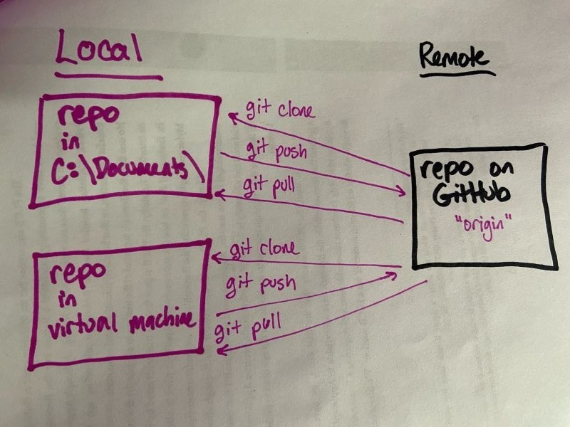

# How to GitHub, Part 1

## A couple of first steps

1. Make sure you have an account on [GitHub](https://github.com) and that you know how to log in to it.
1. Make sure you have Git and a Linux-style command line:
* If you're on Windows, get a copy of [Git Bash](https://git-scm.com/downloads) for yourself. 
* If you're on a Mac, you can use Terminal, and you probably already have git. We can talk through how to get you onto a newer and better version than the default Apple one, but that'll work for tonight. 
* On Ubuntu Linux (including our virtual machines), it's two commands in the command line interface:
	* sudo apt-get update 
	* sudo apt-get install git

## One person, one repo, multiple machines (or directories), not worrying about branches yet

1. Log in to your own GitHub account, on github.com, and create a new repository. For our purposes, let's call it `github_practice`. Check the box to "Initialize this repository with a README". (You'll be able to delete this after we're done tonight if you want!)
1. In Git Bash, navigate to a directory where it makes sense to have some GitHub repositories. My suggested command on Windows, especially on the school machines:
	* `cd /c/Users/[username]/Documents`
1. Clone your repository to your machine. The command you'll type (type all of it except the URL, don't just copy/paste) in Git Bash is
	* `git clone https://github.com/[username]/github_practice.git`
	* this will make a directory inside your current working directory; to do anything else, you'll have to navigate into that directory (`cd github_practice`) 
1. Open the README in whatever editor you like, and change it. Give it a friendlier title than the repository name, and feel free to add other text if you like. For future reference, [this is the Markdown cheat sheet I like to use](https://github.com/adam-p/markdown-here/wiki/Markdown-Cheatsheet). Save your file when you're finished.
1. Go back to Git Bash, and check the status of your repository.
	* `git status`
	* there should be at least one file that needs to be added
1. Add the file you want to track, in this case, README.md.
	* `git add README.md`
	* this isn't best practice, but you'll often see me use `git add *` which adds EVERYTHING - I kind of make up for it by typing `git status` all the time, so I do know what I'm adding
1. Commit your changes.
	* `git commit -m "Added some text to README"` 
	* your commit message (the part in quotes) can be anything, including a set of emojis; if you're GitHubbing alone, you can do what you want, but if you're working with others, it's best to use the commit message to communicate what actually changed
	* if you leave off the -m tag, you can leave a much longer commit message, in whatever editor is the default for the bash shell you're using
1. Push your changes up from your local repo to the repo on the cloud (in GitHub).
	* `git push origin master` 
	* this is the default incantation for pushing to a remote repository, but we'll learn how and when it will change in a few minutes
	* `origin` is the identifier of the remote repository
	* `master` is the name of the branch you're working on
1. Feel free to go see the changes in GitHub.
1. Now **change machines.** If you're on a laptop, log in to the school's machine. If you're on a school machine, go to a different school machine. (Leave the other machine logged in; you'll be back in a couple of minutes.)
1. Clone the repository from GitHub on the new machine, and navigate into the directory housing your local repo on that machine.
1. Create a file; you can do this directly from Git Bash by typing `touch trashfile.txt`
1. Add the file to the files tracked on Git, commit your changes, and push. 
1. Go back to your first machine. (Leave the new machine logged in; you'll be back.) Check the status of the repository with `git status` - oh no, you're behind by one commit! 
	* `git pull origin master`
	* now you have pulled the changes from the remote repository to your local one - if you go look, your new file is in that directory!
1. Do we want to practice making changes and swapping machines a couple more times, to really hammer that skill in, or are we feeling good? Once we're feeling good we will move on to...

[week 10](../week10)